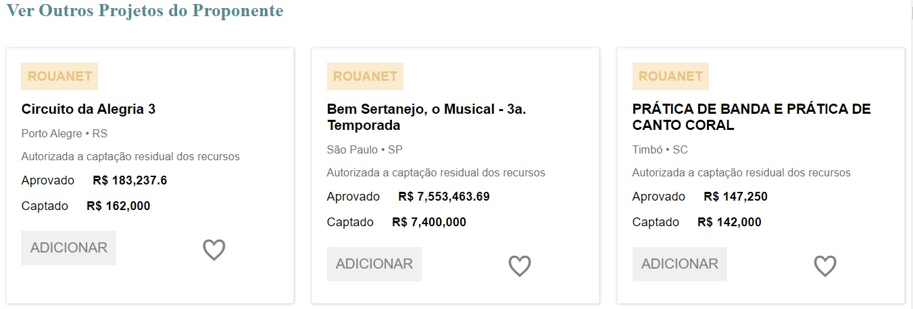

<a name="readme-top"></a>

<!-- PROJECT SHIELDS -->
<!--
*** I'm using markdown "reference style" links for readability.
*** Reference links are enclosed in brackets [ ] instead of parentheses ( ).
*** See the bottom of this document for the declaration of the reference variables
*** for contributors-url, forks-url, etc. This is an optional, concise syntax you may use.
*** https://www.markdownguide.org/basic-syntax/#reference-style-links
-->
<!-- PROJECT LOGO -->
<br />
<div align="center">
  <a href="https://github.com/othneildrew/Best-README-Template">
    
  </a>

  <h3 align="center">Teste de Conhecimento Técnico</h3>
</div>

<!-- ABOUT THE PROJECT -->
## Sobre o Projeto

Um teste para avaliar o conhecimento técnico do colaborador deste repositório por meio do desenvolvimento de uma API em PHP utilizando o framework laravel com uma rota de consumo que retorna os dados em formato JSON. Também desenvolvendo uma aplicação em ReactJS que consuma a API desenvolvida anteriormente e listar os cards lado a lado.



<p align="right">(<a href="#readme-top">voltar para o topo</a>)</p>


### Desenvolvido Com

* [![React][React.js]][React-url]
* [![Laravel][Laravel.com]][Laravel-url]

<p align="right">(<a href="#readme-top">voltar para o topo</a>)</p>


<!-- GETTING STARTED -->
## Rodando a Aplicação

### Pré-requisitos

* node
https://nodejs.org/en

* composer
https://getcomposer.org/doc/00-intro.md

* npm
  ```sh
  npm install npm@latest -g
  ```

### Instalação

Como instalar as dependências para poder rodar a aplicação:

1. Clone o repositório
   ```sh
   git clone https://github.com/Matheus767/Simbiose-Teste
   ```

* ReactJS

1. Install NPM packages
   ```sh
   npm install
   ```
2. Rodar a aplicação
   ```sh
   npm start
   ```

* PHP Laravel

1. Install composer packages
   ```sh
   composer install
   ```

2. Criar banco de dados
nome: tb_projeto_rouanet_teste

3. Run migrations
   ```sh
   php artisan migrate
   ```

4. Importar sql para a tabela criada

5. Subir o server
   ```sh
   php artisan serve
   ```

<p align="right">(<a href="#readme-top">voltar para o topo</a>)</p>

<!-- CONTACT -->
## Contato

Matheus Santos Castiço - mathsilvac@hotmail.com

Link do Projeto: [https://github.com/Matheus767/Simbiose-Teste](https://github.com/Matheus767/Simbiose-Teste)

<p align="right">(<a href="#readme-top">voltar para o topo</a>)</p>

[React.js]: https://img.shields.io/badge/React-20232A?style=for-the-badge&logo=react&logoColor=61DAFB
[React-url]: https://reactjs.org/
[Laravel.com]: https://img.shields.io/badge/Laravel-FF2D20?style=for-the-badge&logo=laravel&logoColor=white
[Laravel-url]: https://laravel.com
